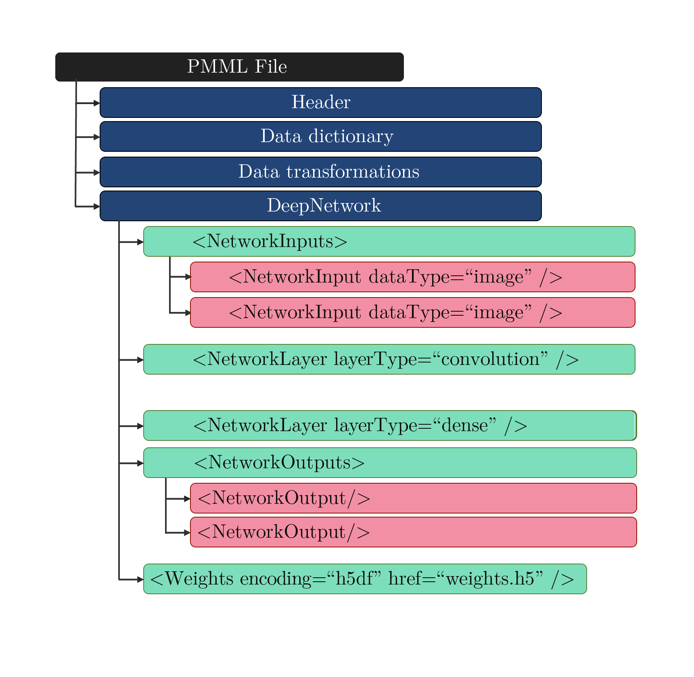

# PMML 5.0 - Convolutional Neural Network

Convolutional neural networks, or CNNs, are a specialized kind of neural network for processing data that has a known grid-like topology. The PMML specification for CNN focuses on the application of CNNs to image data. In a CNN, pixels from each image are converted to a featurized representation through a series of mathematical operations. Input images are represented as an order 3 tensor with height `H`, width `W`, and depth `D`. This representation is modified by several hidden layers until the desired output is achieved. Several layer types are common to most modern CNNs, including convolution, pooling and dense layer types. The PMML specification describes each how the overall network and each layer is represented.



   

## DeepNetwork Element                                                                                                                             

A deep neural network model is represented by a *DeepNetwork* element, which contains all the necessary information to fully characterize the model. The *DeepNetwork* element can have three types of child elements: 

* **NetworkInputs** element defines inputs to the neural network
* **NetworkLayer** elements define the hidden layers in the neural network
* **NetworkOutputs** element defines the outputs of the neural network. 

The PMML specification only supports convolutional neural networks. All *DeepNetwork* elements must have the modelType attribute set to "CNN". A *DeepNetwork* element must have at least one *NetworkInputs* and at least one *NetworkOuputs*. The *DeepNetwork* element must contain one or more *NetworkLayer* elements that describe individual nodes in the dataflow graph. The XML schema for the DeepNetwork element is shown below:

```xml
<xs:element name="ConvolutionalNeuralNetwork">
  <xs:complexType>
    <xs:sequence>
      <xs:element ref="MiningSchema"/>
      <xs:element name="NetworkInputs" />
      <xs:element name="NetworkOutputs" />
      <xs:element maxOccurs="unbounded" name="NetworkLayer" />
      <xs:element name="Weights">
        <xs:complexType>
          <xs:attribute name="encoding" type="xs:string" use="required" />
          <xs:attribute name="href" type="xs:string" use="required" />
        </xs:complexType>
      </xs:element>
    </xs:sequence>
    <xs:attribute name="modelName" type="xs:string" use="required" />
    <xs:attribute name="modelType" type="DNN-MODEL-TYPE" use="required" />
    <xs:attribute name="functionName" type="xs:string" use="required" />
    <xs:attribute name="numberOfLayers" type="xs:nonNegativeInteger" use="required" />
  </xs:complexType>
</xs:element>
```

The CNN is represented as a directed acyclic graph. Each node in the graph represents a neural network layer. Graph edges describe the connections between neural network layers.  The *NetworkInputs* element is used to describe the input to the neural network. The *NetworkLayer* element is used to define additional nodes in the neural network graph. The *layerName* attribute of each *NetworkLayer* and *NetworkInputs* elements uniquely identifies each neural network layer. It is possible to connect two layers by adding a *InboundNodes* child element to the second *NetworkLayer*. If the *InboundNodes* child is not present, then it is assumed that the layer does not have any inputs. 

## Neural Network Layers

The *NetworkLayer* element can be used to represent many different types on CNN layers. The XML schema for a *NetworkLayer* is shown below: 

```xml
<xs:element maxOccurs="unbounded" name="NetworkLayer">
  <xs:complexType>
    <xs:sequence>
      <xs:element minOccurs="0" name="InboundNodes" />
      <xs:element minOccurs="0" name="TargetShape" />
      <xs:element minOccurs="0" name="PoolSize" />
      <xs:element minOccurs="0" name="Strides">
      <xs:element minOccurs="0" name="ConvolutionalKernel"> 
      <xs:element minOccurs="0" name="Padding">
      <xs:element minOccurs="0" name="InputSize">
    </xs:sequence>
  </xs:complexType>
</xs:element>
```


### Convolution Layer

The `convolution` layer convolves a convolutional kernel with the input tensor. The convolution layer is represented using a *NetworkLayer* element with *layerType* set to "Convolution". A *NetworkLayer* with the "convolution" layer type must contain a *ConvolutionalKernel* child element, which describes the properties of the convolutional kernel. The cardinality of the convolutional tensor must be equal to that of the input tensor. The size of the convolutional kernel is governed by the parameter *KernelSize* child element*,* and the stride is governed by the parameter *Strides.* The *DilationRate* child element is optional. If the *DilationRate* is larger than 1 in any direction, then the convolution kernel is expanded (dilated) before it is convolved with the target tensor. An activation function can be optionally applied to the output of this layer. An example of a convolutional layer is provided below:

```xml
<NetworkLayer activation="relu" layerType="Convolution" name="block2_conv1" padding="same" use_bias="True">
  <InboundNodes>
    <Array n="1" type="string">block1_pool</Array>
  </InboundNodes>
  <ConvolutionalKernel channels="128">
    <DilationRate>
      <Array n="2" type="int">1 1</Array>
    </DilationRate>
    <KernelSize>
      <Array n="2" type="int">3 3</Array>
    </KernelSize>
    <Strides>
      <Array n="2" type="int">1 1</Array>
    </Strides>
  </ConvolutionalKernel>
</NetworkLayer>
```


### Dense Layer

A `dense` layer is represented using a *NetworkLayer* element with *layerType* set to "Dense". An activation function can be optionally applied to the output of this layer. This layer is parameterized by weights **W**  and bias **b**. An example of a dense layer is provided below:

```xml
<NetworkLayer activation="relu" channels="4096" layerType="Dense" name="fc1">
  <InboundNodes>
    <Array n="1" type="string">flatten</Array>
  </InboundNodes>
</NetworkLayer>
```

 

### Merge Layer

A `merge` layer takes two or more tensors of equal dimensions and combines them using an elementwise operator. A merge layer is represented using a *NetworkLayer* element with the *layerType* attribute set to "Merge". The *operator* attribute is used to specify the operator used to combine tensor values. Allowable operator types are addition, subtraction, multiplication, and division. An example of a merge layer is provided below:

 ```xml
<NetworkLayer layerType="Merge" name="add_1" operator="add">
  <InboundNodes>
    <Array n="2" type="string">bn2a_branch2c bn2a_branch1</Array>
  </InboundNodes>
</NetworkLayer>
 ```


### Pooling Layer

`Pooling` layers apply a pooling operation over a single tensor. A max pooling layer is represented using a *NetworkLayer* element with the *layerType* attribute set to "MaxPooling". An average pooling layer is represented using a *NetworkLayer* element with the *layerType* attribute set to "AveragePooling". The width of the pooling kernel is governed by the *PoolSize* child element*,* and the stride is governed by the parameter *Strides* child element*. An example of a pooling layer layer is provided below:

```xml
<NetworkLayer layerType="MaxPooling" name="pool1">
    <InboundNodes>
        <Array n="1" type="string">zero_padding2d_2</Array>
    </InboundNodes>
    <PoolSize>
      <Array n="2" type="int">3 3</Array>
    </PoolSize>
    <Strides>
      <Array n="2" type="int">2 2</Array>
    </Strides>
</NetworkLayer>
```

 

### Global Pooling Layer

`Global pooling` layers apply a pooling operation across all spatial dimensions of the input tensor. A global max pooling layer is represented using a *NetworkLayer* element with the *layerType* attribute set to "GlobalMaxPooling". A global average pooling layer is represented using a *NetworkLayer* element with the *layerType* attribute set to "GlobalAveragePooling".  An example of a global pooling layer is provided below:

 ```xml
<NetworkLayer layerType="GlobalAveragePooling" name="avg_pool">
  <InboundNodes>
    <Array n="1" type="string">activation_49</Array>
  </InboundNodes>
</NetworkLayer>
 ```


### Depthwise Convolution Layer

The `depthwise convolution` layer convolves a convolutional filter with the input, keeping each channel separate. In the regular convolution layer, convolution is performed over multiple input channels. The depth of the filter is equal to the number of input channels, allowing values across multiple channels to be combined to form the output. Depthwise convolutions keep each channel separate - hence the name *depthwise*. A depthwise convolution layer is represented using a *NetworkLayer* element with the *layerType* attribute set to "DepthwiseConvolution". The depthwise convolution layer must contain a single ConvolutionalKernel child element. The ConvolutionalKernel child element follows the same requirements as the ConvolutionalKernel elemnt in convolutional layers. An example of a depthwise convolution layer is provided below:

```xml
<NetworkLayer activation="linear" depth_multiplier="1" layerType="DepthwiseConvolution" name="conv_dw_1" padding="same" use_bias="False">
    <InboundNodes>
      <Array n="1" type="string">conv1_relu</Array>
    </InboundNodes>
    <ConvolutionalKernel>
      <KernelSize>
        <Array n="2" type="int">3 3</Array>
      </KernelSize>
      <KernelStride>
        <Array n="2" type="int">1 1</Array>
      </KernelStride>
    </ConvolutionalKernel>
</NetworkLayer>
```


### Batch Normalization Layer

The `batch normalization` (BN) layer aims to generate an output tensor with a constant mean and variance. BN applies a linear transformation between input and output based on the distribution of inputs during the training process. A BN layer is represented using a *NetworkLayer* element with the *layerType* attribute set to "BatchNormalization".  An example of a BN layer is provided below:

 ```xml
<NetworkLayer layerType="BatchNormalization" axis="-1" center="True" epsilon="0.001" momentum="0.99" name="conv_dw_2_bn">
  <InboundNodes>
    <Array n="1" type="string">conv_dw_2</Array>
  </InboundNodes>
</NetworkLayer>
 ```


### Activation Layer

The `activation` layer applies an activation function to each element in the input tensor. An activation layer is represented using a *NetworkLayer* element with the *layerType* attribute set to "Activation". The activation function can be any one of linear, relu, sigmoid, tanh, elu, or softmax. The attribute *threshold* allows the activation function to be offset horizontally.  An example of an activation layer is provided below:

```xml
<NetworkLayer layerType="Activation" activation="relu" max_value="6.0" name="conv1_relu" negative_slope="0.0" threshold="0.0">
    <InboundNodes>
        <Array n="1" type="string">conv1_bn</Array>
    </InboundNodes>
</NetworkLayer>
```


### Padding Layer

A `padding` layer pads the spatial dimensions of a tensor with a constant value, often zero. This operation is commonly used to increase the size of oddly shaped layers, to allow dimension reduction in subsequent layers. A padding layer is represented using a *NetworkLayer* element with the *layerType* attribute set to "Padding". The amount of padding applied to the tensor is specified by the *Padding* element. The *Padding* element must contain exactly one 4-element integer *Array* element. This array specifies the number of padding rows or columns to add to the top, bottom, left and right side of the input tensor. An example of a padding layer is provided below:


 ```xml
<NetworkLayer layerType="Padding" name="conv_pad_2">
  <InboundNodes>
    <Array n="1" type="string">conv_pw_1_relu</Array>
  </InboundNodes>
  <Padding>
    <Array n="4" type="int">0 1 0 1</Array>
  </Padding>
</NetworkLayer>
 ```


### Reshape Layer

A `reshape` layer reshapes the input tensor. The number of values in the input tensor must equal the number of values in the output tensor. The first dimension is not reshaped as this is commonly the batch dimension. A reshape layer is represented using a *NetworkLayer* element with the *layerType* attribute set to "Reshape". The size of the output tensor is specified by the *TargetShape* child element. The *TargetShape* child element must contain a single integer array that describes the size of each dimension.  An example of a reshape layer is provided below:

```xml
<NetworkLayer layerType="Reshape" name="reshape_1">
  <InboundNodes>
    <Array n="1" type="string">global_average_pooling2d_1</Array>
  </InboundNodes>
  <TargetShape>
    <Array n="3" type="int">1 1 1024</Array>
  </TargetShape>
</NetworkLayer
```

The flatten layer is a variant of the reshape layer, that flattens the input tensor such that the output size is where is the number of values in the input tensor. The first dimension is not reshaped as this is commonly the batch dimension. A flatten layer is represented using a *NetworkLayer* element with the *layerType* attribute set to "Flatten".


### Transposed Convolution

`Transposed convolutions`, also called deconvolutions, arise from the desire to use a transformation going in the opposite direction of a normal convolution, for example, to increase the spatial dimensions of a tensor. They are commonly used in CNN decoders, which progressively increase the spatial size of the input tensor. A transposed convolution layer is represented using a *NetworkLayer* element with the *layerType* attribute set to TransposedConv2D.

 

## Neural Network Output

CNN's are commonly used for image classification, segmentation, regression, and object localization. PMML supports all of these output types. The *NetworkOutputs* element is used to define the outputs of a deep neural network. Each output is defined using the *NetworkOutput* element. 


PMML can be used to represent CNN classification models. Classification models approximate a mapping function ( *f* ) from input variables ( X ) to a discrete output variable ( *y* ). The output variables are often called labels or categories. The mapping function predicts the class or category for a given observation. For example, an image can be classified as belonging to one of two classes: “cat” or “dog”. It is common for classification models to predict a continuous value as the probability of a given example belonging to each output class. The probabilities can be interpreted as the likelihood or confidence of a given example belonging to each class. A predicted probability can be converted into a class value by selecting the class label that has the highest probability. The proposed extension introduces a *DiscretizeClassification* element that defines this transformation. Specifically, *DiscretizeClassification* describes a transformation that takes an input tensor of class *likelihoods* and outputs a string describing the most probable class.

PMML can also be used to represent CNN regression models. Formally, regression models approximate a mapping function ( *f* ) from input variables ( X ) to a continuous output variable ( Y ). A continuous output variable is a real-value, such as an integer or floating-point value, or a tensor of continuous values. The existing *FieldRef*  PMML element is used to define regression models. If a *FieldRef* is contained in a *NetworkOuput* then it returns a copy of any specified tensor in the neural network. If the *FieldRef* has a double datatype, then it converts a single element tensors to a single double value. 

PMML can be used to represent CNN segmentation models.  Semantic segmentation is one of the fundamental tasks in computer vision. In semantic segmentation, the goal is to classify each pixel of the image in a specific category. Formally, semantic segmentation models approximate a mapping function ( *f* ) from an input image (X) to a tensor of object classes (Y). Most modern neural network architectures learn a mapping between the input image and a tensor that describes the class likelihood for each pixel. The final step is to select the class with the largest likelihood for each pixel. The proposed PMML extension introduces a *DiscretizeSegmentation* element that defines this transformation. Specifically, *DiscretizeSegmentation* describes a transformation that takes an input tensor and outputs a tensor containing the most likely pixel classes.


## Example

In this example, PMML is used to represent a CNN model to classify hand-written digits. The input of the model is a grayscale image with a size of 14 x 14 x 1. The model contains two convolutional layers, each with a single 3x3x1 convolutional filter. The model also contains a *MaxPooling* layer to reduce the spatial size of the feature representation. After the convolutional and pooling layers, a single *Flatten* layer is used to reshape the feature map to a vector. Two consecutive *Dense* layers use the feature vector to predict the hand-written digit label. The output of the model is a string from the set {"zero", "one", ... "nine"} that matches the number in the input image. The PMML file for the trained model is shown below:


```xml
<?xml version='1.0' encoding='UTF-8'?>
<PMML version="5.0" xmlns="http://www.dmg.org/PMML-5_0">
  <Header copyright="Copyright (c) 2020 NIST" description="Simple model to detect hand-written digits">
    <Timestamp>2020-04-15 10:40:56</Timestamp>
  </Header>
  <DataDictionary numberOfFields="2">
    <DataField channels="1" dataType="tensor" height="14" name="I" optype="categorical" width="14"/>
    <DataField dataType="string" name="class" optype="categorical">
      <Value value="Zero"/>
      <Value value="One"/>
      <Value value="Two"/>
      <Value value="Three"/>
      <Value value="Four"/>
      <Value value="Five"/>
      <Value value="Six"/>
      <Value value="Seven"/>
      <Value value="Eight"/>
      <Value value="Nine"/>
    </DataField>
  </DataDictionary>
  <ConvolutionalNeuralNetwork modelName="Deep Neural Network" functionName="classification" numberOfLayers="6">
    <MiningSchema>
      <MiningField name="image" usageType="active"/>
      <MiningField name="class" usageType="predicted"/>
    </MiningSchema>
    <NetworkOutputs>
      <NetworkOutput>
        <OutputField dataType="string" feature="topClass"/>
      </NetworkOutput>
    </NetworkOutputs>
    <NetworkInputs layerType="InputLayer" name="input_2">
      <NetworkInput>
        <InputSize>
          <Array n="3" type="int">14 14 1</Array>
        </InputSize>
      </NetworkInput>
    </NetworkInputs>
    <NetworkLayer activation="relu" layerType="Convolution" name="conv2d_2" padding="valid" use_bias="True">
      <InboundNodes>
        <Array n="1" type="string">input_2</Array>
      </InboundNodes>
      <ConvolutionalKernel channels="1">
        <DilationRate>
          <Array n="2" type="int">1 1</Array>
        </DilationRate>
        <KernelSize>
          <Array n="2" type="int">3 3</Array>
        </KernelSize>
        <KernelStride>
          <Array n="2" type="int">1 1</Array>
        </KernelStride>
      </ConvolutionalKernel>
    </NetworkLayer>
    <NetworkLayer activation="relu" layerType="Convolution" name="conv2d_3" padding="valid" use_bias="True">
      <InboundNodes>
        <Array n="1" type="string">conv2d_2</Array>
      </InboundNodes>
      <ConvolutionalKernel channels="1">
        <DilationRate>
          <Array n="2" type="int">1 1</Array>
        </DilationRate>
        <KernelSize>
          <Array n="2" type="int">3 3</Array>
        </KernelSize>
        <KernelStride>
          <Array n="2" type="int">1 1</Array>
        </KernelStride>
      </ConvolutionalKernel>
    </NetworkLayer>
    <NetworkLayer layerType="MaxPooling" name="max_pooling2d_1">
      <InboundNodes>
        <Array n="1" type="string">conv2d_3</Array>
      </InboundNodes>
      <PoolSize>
        <Array n="2" type="int">2 2</Array>
      </PoolSize>
      <Strides>
        <Array n="2" type="int">2 2</Array>
      </Strides>
    </NetworkLayer>
    <NetworkLayer layerType="Flatten" name="flatten_1">
      <InboundNodes>
        <Array n="1" type="string">max_pooling2d_1</Array>
      </InboundNodes>
    </NetworkLayer>
    <NetworkLayer activation="relu" channels="16" layerType="Dense" name="dense_2">
      <InboundNodes>
        <Array n="1" type="string">flatten_1</Array>
      </InboundNodes>
    </NetworkLayer>
    <NetworkLayer activation="softmax" channels="10" layerType="Dense" name="dense_3">
      <InboundNodes>
        <Array n="1" type="string">dense_2</Array>
      </InboundNodes>
    </NetworkLayer>
    <Weights encoding="hdf5" href="small_model.h5"/>
  </DeepNetwork>
</PMML>

```

 The weights are stored using the HDF5 format, which is a binary key-value format. HDF5 is not human readable but can be converted to a human-readable format like JSON for display purposes. The contents of the HDF5 file are shown in JSON below:

```json
{
  "conv2d_2": {
    "bias:0": [0.16033408045768738],
    "kernel:0": `<Tensor shape=(3, 3, 1, 1)>`
  },
  "conv2d_3": {
    "bias:0": [-0.1472928673028946],
    "kernel:0": `<Tensor shape=(3, 3, 1, 1)>`
  },
  "dense_2": {
    "bias:0": `<Tensor shape=(16,)>`,
    "kernel:0": `<Tensor shape=(25, 16)>`
  },
  "dense_3": {
    "bias:0": `<Tensor shape=(10,)>`,
    "kernel:0": `<Tensor shape=(16, 10)>`
  },
  "dropout_2": {},
  "dropout_3": {},
  "flatten_1": {},
  "input_2": {},
  "max_pooling2d_1": {}
}
```

Large tensors have been replaced by `<Tensor>` for display purposes. The model is evaluated against the single-channel grayscale image shown below:

 

 

This image can be expressed as a Matrix:


All numbers are rounded to two decimal places for visual clarity. The unrounded values are used for calculations. The first layer in the DeepNetwork file is a Convolution layer. The convolution kernel (W<sub>1</sub>) and bias (b<sub>1</sub>) are loaded from the weights file. The output of the first layer (a<sub>1</sub>) can be calculated as follows:


where "*" indicates the convolution operator and "+" is an element-wise addition. The output of the second convolution layer (a<sub>2</sub>) is calculated as:


The next layer in the CNN is a *MaxPooling2D* layer with a 2x2 kernel size. The stride of the pooling kernel is 2. The MaxPooling2D layer does not have any learanable parameters stored in the weights file. Applying the pooling operation gives the output of the third layer (a<sub>3</sub>).

 

	


The output is flattened into a single vector using a *Flatten* layer:


The next layer in the CNN is a *Dense* layer. The weight matrix (W<sub>5</sub>) and the bias (b<sub>5</sub>) are loaded from the weights file. The output of the dense layer (a<sub>5</sub>) can be calulated as follows:


The first *Dense* layer is followed by a second *Dense* layer. The weight matrix (W<sub>6</sub>) and the bias (b<sub>6</sub>) are loaded from the weights file. The output of the second *Dense* layer (a<sub>6</sub>) can be calulated as follows:


The output of this layer (a<sub>6</sub>) is the score for each class. The PMML file specifies that the model should return the "topClass". The top class can be calculated by applying an argmax operation to a<sub>6</sub>:


Here, the number 7 refers to the element at position 7 in the DataDictionary (using zero-based indexing). The element at index position 7 in the data dictionary is "Seven", so the model should return "Seven".

